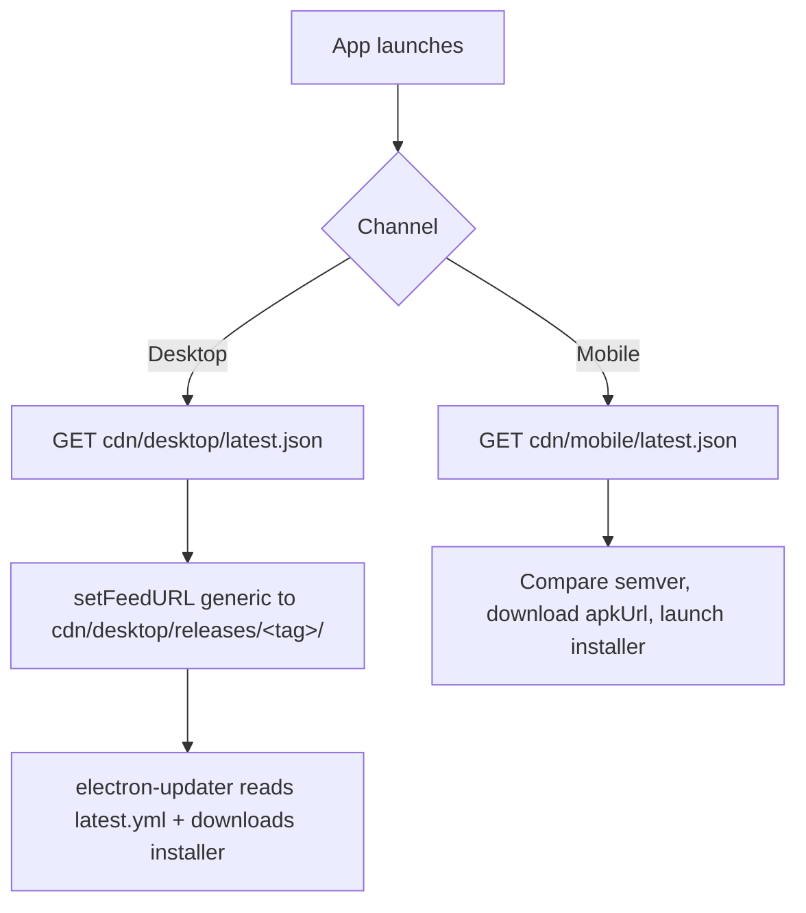

# OTA Updates → Cloudflare R2 Migration Plan

Move desktop (electron-updater) and mobile (in-app APK) OTA assets off GitHub
Releases and onto **Cloudflare R2**, so the GitHub repository can be made
**private** while end-user devices keep auto-updating. Retain the **last 5
releases** per channel and prune older ones automatically on every publish.

---

## 1. Why this change is needed

Both updaters today depend on the repo being **public** in two ways:

| Channel | Version discovery | Asset download |
| --- | --- | --- |
| Desktop (`desktop/updater.ts`) | `GET api.github.com/.../releases` to find newest `v*` tag | `releases/download/<tag>/latest.yml` + installers (electron-updater generic feed) |
| Mobile (`mobile/src/updater.ts`) | `GET api.github.com/.../releases` to find newest `mobile-v*` release | asset `browser_download_url` (`WorkPulse-<v>.apk`) |

When the repo goes private, both the unauthenticated API listing **and** the
asset URLs start returning `404/403`. Embedding a GitHub token in shipped apps
is not acceptable. The fix: host assets **and** a tiny version manifest on R2
behind a **public** Cloudflare custom domain (no auth needed to read), and have
the apps read from there instead of GitHub.

GitHub Releases can still be created for changelog/history if desired — they
just stop being the delivery mechanism.

---

## 2. Target architecture

```
Cloudflare R2 bucket:  workpulse-ota   (public via custom domain, e.g. https://cdn.workpulse.app)

desktop/
  latest.json                         # { "version": "1.6.95", "tag": "v1.6.95" }   (no-cache)
  releases/
    v1.6.95/
      latest.yml                      # electron-updater manifest (Windows)
      latest-mac.yml
      latest-linux.yml
      WorkPulse-Setup-1.6.95.exe
      WorkPulse-Setup-1.6.95.exe.blockmap
      *.dmg / *.dmg.blockmap / *.zip / *.AppImage / *.deb
    v1.6.94/ ...                       # last 5 kept, older pruned

mobile/
  latest.json                         # { "version": "1.0.29", "apkUrl": "...", "notes": "...", "releaseUrl": "..." }
  releases/
    mobile-v1.0.29/
      WorkPulse-1.0.29.apk
    mobile-v1.0.28/ ...                # last 5 kept, older pruned
```

Update flow after migration:



Design notes:
- `latest.json` lives at a **stable** path and is served `Cache-Control: no-cache`
  so devices always see new versions immediately.
- Versioned folders are **immutable** and can be cached aggressively.
- electron-updater only needs the feed URL to point at the folder containing
  `latest.yml`; the `path:` entries inside resolve relative to it (this is
  exactly how the current GitHub generic feed already works — only the base URL
  changes).
- R2 is **S3-compatible**, so GitHub Actions can use the preinstalled `aws` CLI
  with `--endpoint-url`. No new action dependency required.

---

## 3. Phase A — Cloudflare R2 setup (one-time, manual)

1. **Create the bucket**
   - Cloudflare Dashboard → R2 → *Create bucket* → name `workpulse-ota`.
   - Location: Automatic.

2. **Expose it publicly via a custom domain** (recommended over the `r2.dev`
   dev URL, which is rate-limited and not meant for production):
   - Bucket → *Settings* → *Public access* → *Connect Domain* → e.g.
     `cdn.workpulse.app` (must be a zone in your Cloudflare account).
   - This creates the CDN-cached public origin. Note the base URL — call it
     `R2_PUBLIC_BASE_URL` (e.g. `https://cdn.workpulse.app`).
   - (Alternative for testing only: enable the `r2.dev` URL and use that as the
     base.)

3. **Set a default cache rule** (optional but nice): add a Cache Rule for
   `cdn.workpulse.app/*/latest.json` → *Bypass cache* (belt-and-suspenders with
   the per-object `no-cache` header set at upload time).

4. **Create an R2 API token** (Account → R2 → *Manage R2 API Tokens* →
   *Create API token*):
   - Permissions: **Object Read & Write**, scoped to the `workpulse-ota` bucket.
   - Save: **Access Key ID**, **Secret Access Key**, and your **Account ID**.
   - S3 endpoint is `https://<ACCOUNT_ID>.r2.cloudflarestorage.com`.

5. **CORS** (only needed because the mobile app fetches `latest.json` and the
   APK via `fetch`/download from a different origin). Bucket → *Settings* →
   *CORS policy*:
   ```json
   [
     {
       "AllowedOrigins": ["*"],
       "AllowedMethods": ["GET", "HEAD"],
       "AllowedHeaders": ["*"],
       "MaxAgeSeconds": 3600
     }
   ]
   ```
   (electron-updater on desktop is a Node HTTP client and is not subject to CORS,
   but this is harmless and helps the mobile/web cases.)

---

## 4. Phase B — GitHub repository secrets & variables

Add under *Settings → Secrets and variables → Actions*:

**Secrets**
| Name | Value |
| --- | --- |
| `R2_ACCOUNT_ID` | Cloudflare account id |
| `R2_ACCESS_KEY_ID` | R2 API token access key id |
| `R2_SECRET_ACCESS_KEY` | R2 API token secret |

**Variables** (non-secret, so they can also be baked into client builds)
| Name | Value |
| --- | --- |
| `R2_BUCKET` | `workpulse-ota` |
| `R2_PUBLIC_BASE_URL` | `https://cdn.workpulse.app` |

> Keep existing secrets (`GOOGLE_API_KEY`, `ANDROID_GOOGLE_SERVICES_JSON`) —
> they are unrelated to this migration.

---

## 5. Phase C — Reusable R2 upload + prune logic

Both workflows share the same upload/manifest/prune sequence. The snippet below
is the canonical implementation; the per-channel sections plug their own paths
into it. R2's S3 API is used via the runner's preinstalled `aws` CLI.

Common env block (per job):
```yaml
env:
  AWS_ACCESS_KEY_ID: ${{ secrets.R2_ACCESS_KEY_ID }}
  AWS_SECRET_ACCESS_KEY: ${{ secrets.R2_SECRET_ACCESS_KEY }}
  AWS_DEFAULT_REGION: auto
  AWS_REQUEST_CHECKSUM_CALCULATION: when_required   # R2 rejects newer aws-cli default checksums; see note
  AWS_RESPONSE_CHECKSUM_VALIDATION: when_required
  R2_ENDPOINT: https://${{ secrets.R2_ACCOUNT_ID }}.r2.cloudflarestorage.com
  R2_BUCKET: ${{ vars.R2_BUCKET }}
  R2_PUBLIC_BASE_URL: ${{ vars.R2_PUBLIC_BASE_URL }}
```

> **aws-cli + R2 checksum note:** recent `aws-cli` v2 versions send
> `x-amz-checksum-*` headers that R2 can reject with `501 Not Implemented`. The
> two `*_CHECKSUM_*=when_required` env vars above disable that. If the runner's
> `aws` is older and doesn't recognise them, they're simply ignored.

Generic prune helper (keep newest 5 version folders under a prefix):
```bash
# usage: prune_releases <s3-prefix> <grep-pattern>
#   prune_releases "desktop/releases" '^v[0-9]'
#   prune_releases "mobile/releases"  '^mobile-v[0-9]'
prune_releases() {
  local prefix="$1" pat="$2" keep=5
  local all sorted total remove
  all=$(aws s3 ls "s3://${R2_BUCKET}/${prefix}/" --endpoint-url "$R2_ENDPOINT" \
        | awk '{print $2}' | sed 's#/##' | grep -E "$pat" || true)
  [ -z "$all" ] && { echo "Nothing under ${prefix} to prune"; return 0; }
  sorted=$(echo "$all" | sort -V)
  total=$(echo "$sorted" | grep -c .)
  if [ "$total" -le "$keep" ]; then
    echo "Only ${total} releases under ${prefix}; keeping all"
    return 0
  fi
  remove=$(echo "$sorted" | head -n $((total - keep)))
  for r in $remove; do
    echo "Pruning old release: ${prefix}/${r}"
    aws s3 rm "s3://${R2_BUCKET}/${prefix}/${r}/" --recursive --endpoint-url "$R2_ENDPOINT"
  done
}
```

---

## 6. Phase D — Desktop workflow changes (`.github/workflows/desktop-release.yml`)

The existing `build` job already stages installers as artifacts
(`installers-<os>`). Add a new `publish-r2` job that runs **after** `build`
(in parallel with, or instead of, `release-notes`).

```yaml
  publish-r2:
    needs: [validate, build]
    runs-on: ubuntu-latest
    env:
      AWS_ACCESS_KEY_ID: ${{ secrets.R2_ACCESS_KEY_ID }}
      AWS_SECRET_ACCESS_KEY: ${{ secrets.R2_SECRET_ACCESS_KEY }}
      AWS_DEFAULT_REGION: auto
      AWS_REQUEST_CHECKSUM_CALCULATION: when_required
      AWS_RESPONSE_CHECKSUM_VALIDATION: when_required
      R2_ENDPOINT: https://${{ secrets.R2_ACCOUNT_ID }}.r2.cloudflarestorage.com
      R2_BUCKET: ${{ vars.R2_BUCKET }}
      VERSION: ${{ needs.validate.outputs.version }}
    steps:
      - name: Download all installers
        uses: actions/download-artifact@v4
        with:
          pattern: installers-*
          path: installers
          merge-multiple: true

      - name: Upload release assets to R2 (immutable, long cache)
        run: |
          set -euo pipefail
          TAG="v${VERSION}"
          DEST="s3://${R2_BUCKET}/desktop/releases/${TAG}/"
          echo "Uploading $(ls -1 installers | wc -l) files to ${DEST}"
          # Installers/blockmaps: cache forever (folder is immutable).
          aws s3 cp installers/ "$DEST" --recursive \
            --endpoint-url "$R2_ENDPOINT" \
            --cache-control "public, max-age=31536000, immutable" \
            --exclude "*.yml" --exclude "*.yaml"
          # latest*.yml: still inside the versioned folder, but mark no-cache so a
          # re-published same-version build is picked up.
          aws s3 cp installers/ "$DEST" --recursive \
            --endpoint-url "$R2_ENDPOINT" \
            --content-type "text/yaml" \
            --cache-control "no-cache" \
            --exclude "*" --include "*.yml" --include "*.yaml"

      - name: Write desktop latest.json (stable pointer, no-cache)
        run: |
          set -euo pipefail
          printf '{"version":"%s","tag":"v%s"}' "$VERSION" "$VERSION" > latest.json
          aws s3 cp latest.json "s3://${R2_BUCKET}/desktop/latest.json" \
            --endpoint-url "$R2_ENDPOINT" \
            --content-type "application/json" \
            --cache-control "no-cache, no-store, must-revalidate"

      - name: Prune old desktop releases (keep newest 5)
        run: |
          set -euo pipefail
          all=$(aws s3 ls "s3://${R2_BUCKET}/desktop/releases/" --endpoint-url "$R2_ENDPOINT" \
                | awk '{print $2}' | sed 's#/##' | grep -E '^v[0-9]' || true)
          sorted=$(echo "$all" | sort -V); total=$(echo "$sorted" | grep -c . || true)
          if [ "${total:-0}" -gt 5 ]; then
            for r in $(echo "$sorted" | head -n $((total - 5))); do
              echo "Pruning desktop/releases/${r}"
              aws s3 rm "s3://${R2_BUCKET}/desktop/releases/${r}/" --recursive --endpoint-url "$R2_ENDPOINT"
            done
          else
            echo "Only ${total:-0} desktop releases; keeping all"
          fi
```

The `release-notes` job (GitHub Release creation) is now **optional**. Keep it
for human-readable changelogs/history, or delete it. It no longer drives
delivery.

> No change is needed to `electron-builder.yml` for runtime correctness — the
> generated `latest.yml` references installers by relative `path:`. Optionally
> switch `publish.provider` to `generic` with
> `url: ${R2_PUBLIC_BASE_URL}/desktop/releases/${version}/` for cleaner
> semantics, but it is not required since the desktop app sets the feed URL at
> runtime (see Phase F).

---

## 7. Phase E — Mobile workflow changes (`.github/workflows/mobile-release.yml`)

The `build` job already stages `release-assets/WorkPulse-<version>.apk` as the
`mobile-apk` artifact. Add an R2 publish job:

```yaml
  publish-r2:
    needs: [validate, build]
    runs-on: ubuntu-latest
    env:
      AWS_ACCESS_KEY_ID: ${{ secrets.R2_ACCESS_KEY_ID }}
      AWS_SECRET_ACCESS_KEY: ${{ secrets.R2_SECRET_ACCESS_KEY }}
      AWS_DEFAULT_REGION: auto
      AWS_REQUEST_CHECKSUM_CALCULATION: when_required
      AWS_RESPONSE_CHECKSUM_VALIDATION: when_required
      R2_ENDPOINT: https://${{ secrets.R2_ACCOUNT_ID }}.r2.cloudflarestorage.com
      R2_BUCKET: ${{ vars.R2_BUCKET }}
      R2_PUBLIC_BASE_URL: ${{ vars.R2_PUBLIC_BASE_URL }}
      VERSION: ${{ needs.validate.outputs.version }}
    steps:
      - uses: actions/checkout@v6
        with: { fetch-depth: 0 }

      - name: Download APK artifact
        uses: actions/download-artifact@v4
        with:
          name: mobile-apk
          path: release-assets

      - name: Upload APK to R2
        run: |
          set -euo pipefail
          TAG="mobile-v${VERSION}"
          APK="release-assets/WorkPulse-${VERSION}.apk"
          test -f "$APK" || { echo "::error::Missing $APK"; exit 1; }
          aws s3 cp "$APK" "s3://${R2_BUCKET}/mobile/releases/${TAG}/WorkPulse-${VERSION}.apk" \
            --endpoint-url "$R2_ENDPOINT" \
            --content-type "application/vnd.android.package-archive" \
            --cache-control "public, max-age=31536000, immutable"

      - name: Build release notes JSON
        id: notes
        run: |
          set -euo pipefail
          PREV_TAG=$(git tag --sort=-creatordate | grep '^mobile-v' | sed -n '2p' || true)
          NOTES=""
          if [ -n "$PREV_TAG" ]; then
            NOTES=$(git log "${PREV_TAG}"..HEAD --pretty=format:'- %s' --no-merges | head -30 || true)
          fi
          # JSON-escape the notes safely with jq.
          jq -n \
            --arg version "$VERSION" \
            --arg apkUrl  "${R2_PUBLIC_BASE_URL}/mobile/releases/mobile-v${VERSION}/WorkPulse-${VERSION}.apk" \
            --arg notes   "$NOTES" \
            --arg releaseUrl "${R2_PUBLIC_BASE_URL}/mobile/releases/mobile-v${VERSION}/" \
            '{version:$version, apkUrl:$apkUrl, notes:$notes, releaseUrl:$releaseUrl}' \
            > latest.json
          cat latest.json

      - name: Write mobile latest.json (stable pointer, no-cache)
        run: |
          aws s3 cp latest.json "s3://${R2_BUCKET}/mobile/latest.json" \
            --endpoint-url "$R2_ENDPOINT" \
            --content-type "application/json" \
            --cache-control "no-cache, no-store, must-revalidate"

      - name: Prune old mobile releases (keep newest 5)
        run: |
          set -euo pipefail
          all=$(aws s3 ls "s3://${R2_BUCKET}/mobile/releases/" --endpoint-url "$R2_ENDPOINT" \
                | awk '{print $2}' | sed 's#/##' | grep -E '^mobile-v[0-9]' || true)
          sorted=$(echo "$all" | sort -V); total=$(echo "$sorted" | grep -c . || true)
          if [ "${total:-0}" -gt 5 ]; then
            for r in $(echo "$sorted" | head -n $((total - 5))); do
              echo "Pruning mobile/releases/${r}"
              aws s3 rm "s3://${R2_BUCKET}/mobile/releases/${r}/" --recursive --endpoint-url "$R2_ENDPOINT"
            done
          else
            echo "Only ${total:-0} mobile releases; keeping all"
          fi
```

Keep or drop the existing GitHub `release` job as desired (history vs. pure R2).

---

## 8. Phase F — App runtime code changes

### 8.1 Desktop (`desktop/updater.ts`)

Replace the GitHub-API discovery with a tiny `latest.json` fetch from R2.

- Add a constant for the base URL (hardcode it, or read from an env baked at
  build time):
  ```ts
  const OTA_BASE_URL = "https://cdn.workpulse.app"; // R2 public custom domain
  ```
- Replace `resolveLatestDesktopTag()` body: instead of
  `GET api.github.com/.../releases`, do
  `GET ${OTA_BASE_URL}/desktop/latest.json` and return its `.tag`
  (e.g. `"v1.6.95"`). Keep the same null-on-failure contract.
- Update `pointFeedAtLatestDesktopRelease()` to point at R2:
  ```ts
  autoUpdater.setFeedURL({
    provider: "generic",
    url: `${OTA_BASE_URL}/desktop/releases/${tag}/`,
  });
  ```
- The rest of `setupUpdater()` (autoDownload, retries, IPC events) is unchanged
  because electron-updater still just reads `latest.yml` from the feed folder.
- `GITHUB_OWNER` / `GITHUB_REPO` / `DESKTOP_TAG_RE` / the releases-API plumbing
  can be deleted once nothing references them.

### 8.2 Mobile (`mobile/src/updater.ts`)

Replace the GitHub releases-API call in `checkForMobileUpdate()` with a single
`latest.json` fetch. `downloadAndInstallApk()` is unchanged (it already takes an
arbitrary `apkUrl`).

- Add the base URL via Expo public env so it can vary per build:
  ```ts
  const OTA_BASE_URL =
    process.env.EXPO_PUBLIC_OTA_BASE_URL || "https://cdn.workpulse.app";
  ```
  …and set `EXPO_PUBLIC_OTA_BASE_URL` in the mobile workflow `build` job env
  (alongside `EXPO_PUBLIC_API_BASE_URL`).
- New `checkForMobileUpdate()` shape:
  ```ts
  const res = await fetch(`${OTA_BASE_URL}/mobile/latest.json`, {
    headers: { Accept: "application/json" },
    cache: "no-store",
  });
  if (!res.ok) return { available: false, currentVersion, reason: "error" };
  const latest = (await res.json()) as {
    version: string; apkUrl: string; notes?: string; releaseUrl?: string;
  };
  if (compareSemver(latest.version, currentVersion) <= 0) {
    return { available: false, currentVersion, version: latest.version, reason: "up-to-date" };
  }
  return {
    available: true,
    version: latest.version,
    currentVersion,
    notes: cleanReleaseNotes(latest.notes || ""),
    apkUrl: latest.apkUrl,
    releaseUrl: latest.releaseUrl,
  };
  ```
- `GITHUB_OWNER` / `GITHUB_REPO` / `MOBILE_TAG_RE` / `GitHubRelease` /
  `GitHubAsset` / the per-asset `.apk` scan can be removed once unused.
- `MobileUpdateInfo` and `UpdateChecker.tsx` need **no** changes — the public
  shape (`apkUrl`, `notes`, `releaseUrl`, `reason`) is preserved.

> **Version skew safety:** ship the runtime change (Phase F) **before** making
> the repo private, in a release that is still delivered via GitHub. Otherwise
> already-installed apps still pointing at GitHub will stop seeing updates the
> moment the repo flips private. See rollout order below.

---

## 9. Phase G — Rollout order (critical)

Because installed apps only learn the new update source *after* they install a
build that contains the Phase F code, the source switch must lead the repo
privacy flip:

1. **Implement** Phase A–F on a branch. R2 bucket live and reachable.
2. **Publish a transitional release** (`v` and `mobile-v`) that:
   - still uploads to GitHub Releases (so currently-installed apps update), **and**
   - also uploads to R2 (so new installs work), **and**
   - contains the Phase F runtime code that reads from R2.
   Run both the old GitHub upload steps and the new R2 steps for this one release.
3. **Verify** real devices on the transitional build successfully fetch from R2
   (watch desktop updater logs / mobile UpdateChecker; confirm `latest.json` and
   asset 200s in Cloudflare analytics).
4. **Publish one more release delivered only via R2** and confirm both channels
   update end-to-end from R2 only.
5. **Make the repo private.** Optionally remove the GitHub upload steps from both
   workflows.
6. Decommission reliance on `api.github.com` (already removed in Phase F).

Devices still on a pre-transitional build will be stranded on GitHub and must be
updated manually once (download the new installer/APK directly from R2). This is
unavoidable for the very first cutover.

---

## 10. Phase H — Verification checklist

- [ ] `curl -I https://cdn.workpulse.app/desktop/latest.json` → `200`,
      `cache-control: no-cache`.
- [ ] `curl -I https://cdn.workpulse.app/desktop/releases/v<ver>/latest.yml` → `200`.
- [ ] Desktop app (older version) launched → updater logs show feed pinned to
      `cdn.../desktop/releases/v<new>/`, downloads, prompts, installs.
- [ ] `curl https://cdn.workpulse.app/mobile/latest.json` → correct `version` +
      `apkUrl`.
- [ ] Mobile app (older version) → UpdateChecker modal appears, APK downloads
      with progress, installer launches.
- [ ] After a 6th release, `aws s3 ls .../desktop/releases/` and
      `.../mobile/releases/` show exactly **5** version folders each.
- [ ] Repo set to **private**; a fresh device still updates from R2.

---

## 11. Task list (tracking)

### Cloudflare
- [ ] Create R2 bucket `workpulse-ota`.
- [ ] Attach public custom domain `cdn.workpulse.app` (note `R2_PUBLIC_BASE_URL`).
- [ ] Add CORS policy (GET/HEAD, `*`).
- [ ] Create scoped R2 API token (Object Read & Write).
- [ ] (Optional) Cache rule: bypass cache for `*/latest.json`.

### GitHub config
- [ ] Add secrets `R2_ACCOUNT_ID`, `R2_ACCESS_KEY_ID`, `R2_SECRET_ACCESS_KEY`.
- [ ] Add variables `R2_BUCKET`, `R2_PUBLIC_BASE_URL`.

### Desktop
- [ ] Add `publish-r2` job to `desktop-release.yml` (upload + latest.json + prune).
- [ ] Update `desktop/updater.ts`: `OTA_BASE_URL`, read `desktop/latest.json`,
      point feed at R2 folder; remove GitHub API code.
- [ ] (Optional) Keep/trim `release-notes` GitHub job.

### Mobile
- [ ] Add `publish-r2` job to `mobile-release.yml` (upload + latest.json + prune).
- [ ] Add `EXPO_PUBLIC_OTA_BASE_URL` to mobile build job env.
- [ ] Update `mobile/src/updater.ts`: read `mobile/latest.json`; remove GitHub
      API code. (`UpdateChecker.tsx` untouched.)
- [ ] (Optional) Keep/trim `release` GitHub job.

### Cutover
- [ ] Ship transitional release to BOTH GitHub + R2 (contains Phase F code).
- [ ] Verify devices update from R2.
- [ ] Ship an R2-only release; verify.
- [ ] Make repo private.
- [ ] Remove GitHub upload steps (optional).

---

## 12. Cost & operational notes

- **Storage:** ~5 desktop releases × (~3 platforms × ~100–250 MB) + 5 APKs
  (~80–150 MB each) ≈ a few GB. R2 free tier is 10 GB storage; well within it.
- **Egress:** R2 has **zero egress fees** — the main reason it beats S3/GitHub
  bandwidth for an OTA CDN.
- **Class A ops** (writes/lists/deletes) happen only on release; negligible.
- **Class B ops** (reads) are cheap and the first 10M/month are free.
- Pruning keeps cost flat over time.
- **Integrity:** consider also uploading the existing `checksums.txt` per release
  and/or embedding SHA-256 in `latest.json`; electron-updater already verifies
  via `latest.yml`'s `sha512`. For mobile you may add an optional checksum field
  later and verify post-download before launching the installer.
```

